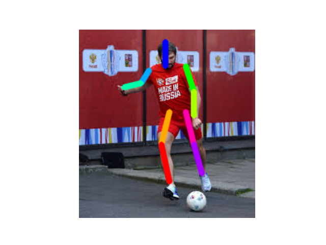
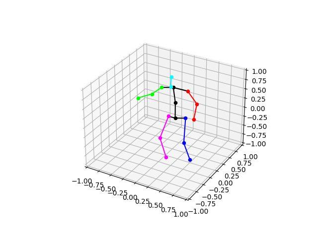
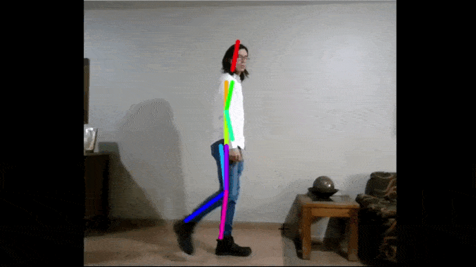
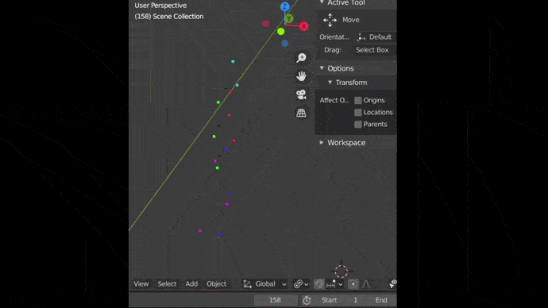
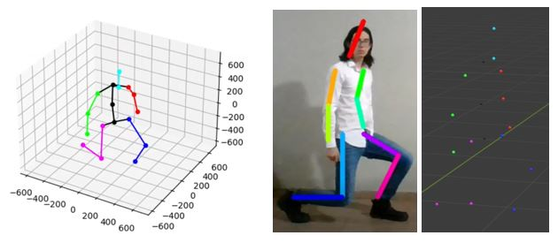
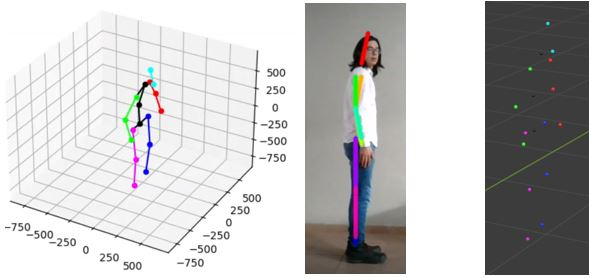
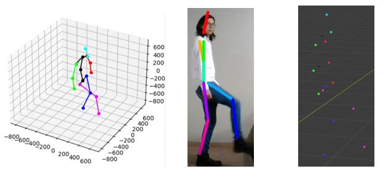

# Blender animations using human pose estimation models

This repo contains all files and samples necessaries to estimate pose, save the points of each frame of a video and upload those frames into Blender.

Test were made using two repositories.

https://github.com/jiajunhua/ildoonet-tf-pose-estimation  
https://github.com/DenisTome/Lifting-from-the-Deep-release

## Install

### Requirements
- CUDA (Nvidia GPU) 10.0 version: (tested with NVIDIA GEFORCE GTX 1650 Ti 4 GB)
- NVIDIA graphics card with at least 1.2 GB available.
- Highly recommended: cuDNN 7.6.5 or compatible version for CUDA.

Change these lines in estimator.py from the first repository and \_pose_estimator.py from the second for your specific needs.
```
gpu_options = tf.GPUOptions(per_process_gpu_memory_fraction=0.3)
sess = tf.Session(config=tf.ConfigProto(gpu_options=gpu_options))
```

I set the limit up to 30% of my GPU memory.

### Clone and install requirements

1. Create conda environment with Python 3.6

2. Clone the repo and install 3rd-party libraries from requirements.txt.

```bash
$ git clone https://github.c/OscarSantos98/TF_pose_estimation_and_Blender
$ cd TF_pose_estimation_and_Blender
$ pip install -r requirements.txt
```

*Dependencies*

You need dependencies below.

- tensorflow-gpu 1.16
- opencv3, protobuf, python3-tk
- slidingwindow
  - https://github.com/adamrehn/slidingwindow
  - With some changes from the above git repo.


Build c++ library for post processing. See : https://github.com/ildoonet/tf-pose-estimation/tree/master/tf_pose/pafprocess
```
$ cd tf_pose/pafprocess
$ swig -python -c++ pafprocess.i && python3 setup.py build_ext --inplace
```

### Blender

- Blender 2.91

Probably it works in different versions as well, but it was tested using that version.

## Repositories

To test first repo follow the following [instructions](https://github.com/OscarSantos98/ildoonet-tf-pose-estimation)

To test second repo go to the following [folder](https://github.com/OscarSantos98/TF_pose_estimation_and_Blender/LiftingfromtheDeeprelease)

## Demo

1. Run [save\_points.py](https://github.com/OscarSantos98/TF_pose_estimation_and_Blender/LiftingfromtheDeeprelease/applications/save_points.py)

You will see that json file is generated with 17 points estimated by Lifting from the Deep model. The idea is to save 17 points of each frame of a video. 





Therefore, same code was implemented in [camera.py](https://github.com/OscarSantos98/TF_pose_estimation_and_Blender/LiftingfromtheDeeprelease/applications/camera.py)

2. Run [use\_points.py](https://github.com/OscarSantos98/TF_pose_estimation_and_Blender/LiftingfromtheDeeprelease/applications/use_points.py)

This will access to the 17 points saved from the previous script and print them in the terminal.

3. Run [camera.py](https://github.com/OscarSantos98/TF_pose_estimation_and_Blender/LiftingfromtheDeeprelease/applications/camera.py)

This generates the json file that will be imported in Blender.

4. Open [BodyMaleTemplate_spheres.blend](https://github.com/OscarSantos98/TF_pose_estimation_and_Blender/LiftingfromtheDeeprelease/applications/BodyMaleTemplate_spheres.blend), then run spheres_test.py while selecting all spheres from the canvas.

This script creates the animation.

5. Clic play on the timeline.





Enjoy it!

Here are some comparisons between video, matplotlib 3d figure and Blender.






